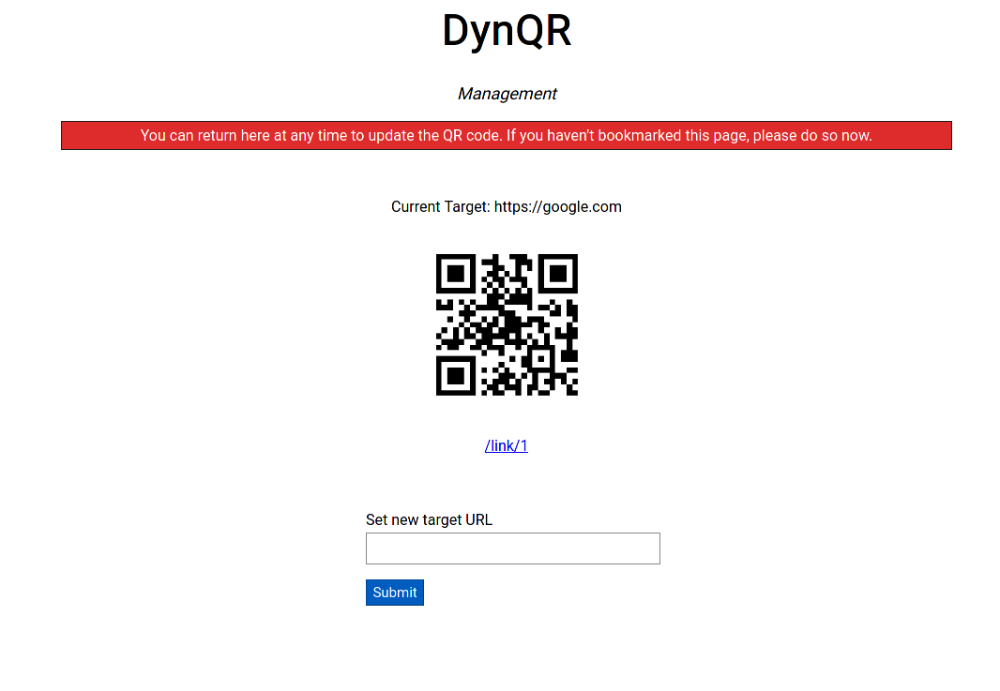

# DynQR

*Dynamic QR code generator.*

Generate and manage dynamic QR codes.


## Compilation

1. Run `go install github.com/rakyll/statik`
2. `make build`
3. Run the binary

## Usage
```text
Usage of ./dynamic-qr:
  -bind string
        Specify the address to bind to. (default "127.0.0.1:8080")
  -csrf string
        The csrf key to be used. (default "foo")
  -db string
        Specify the location of the database. (default "./qrcodes.db")
```

## Screenshot


## License

GPLv3
